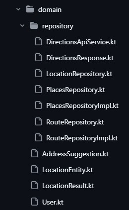
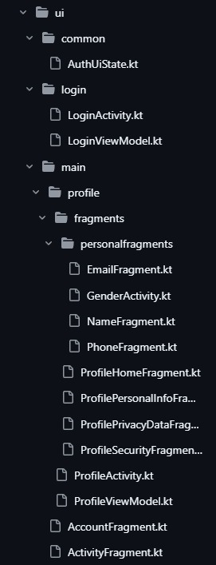
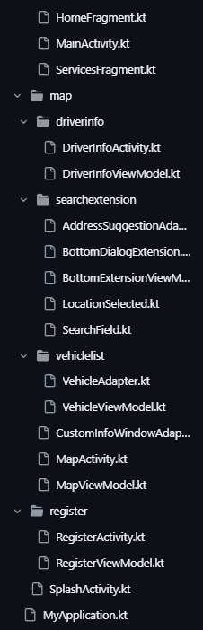
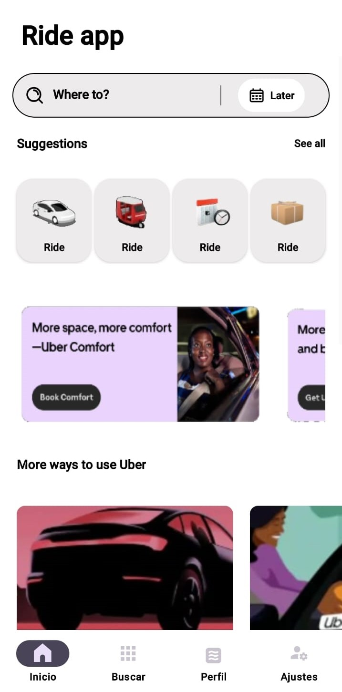
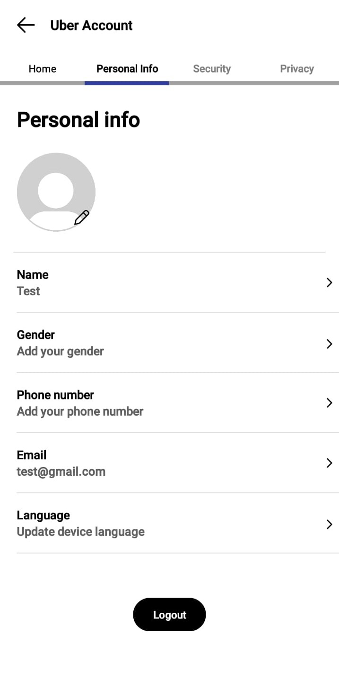
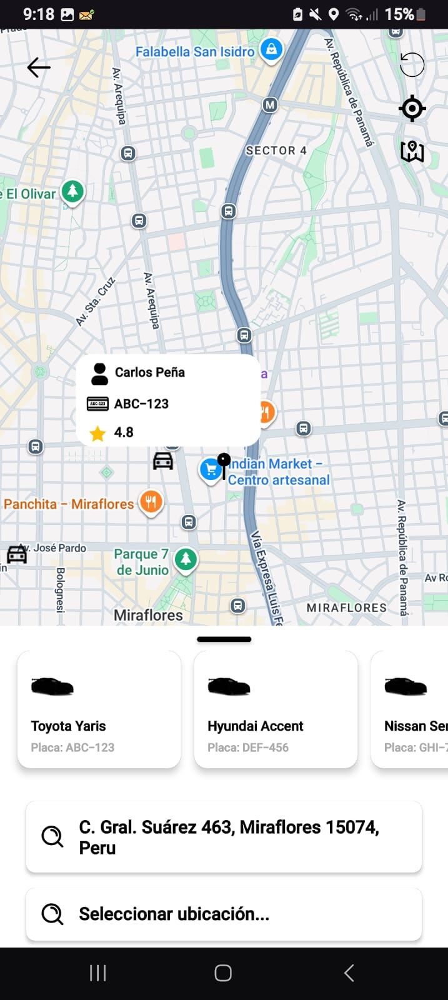
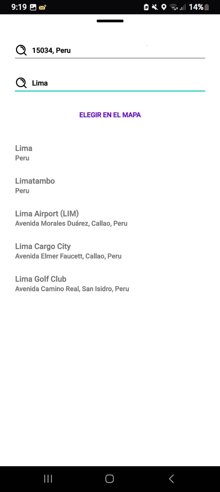
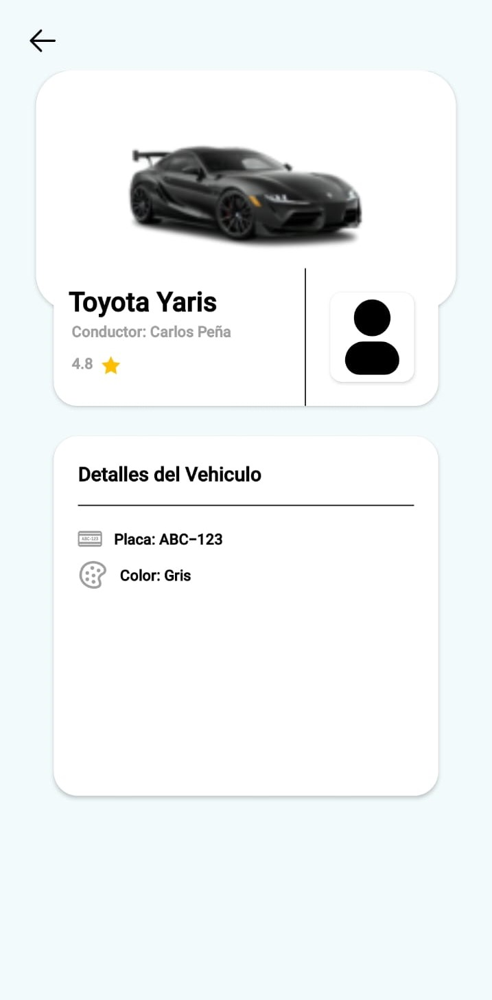
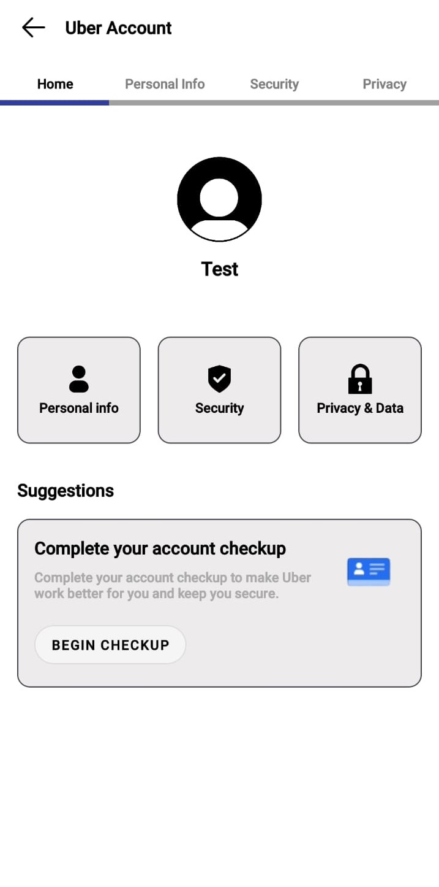

# Uber Clone: Clean Architecture & Firebase

Este repositorio es una vitrina de ingeniería de alto nivel enfocada en construir una solución de movilidad escalable. A diferencia de los prototipos estándar, este proyecto enfatiza la sincronización de datos de alta disponibilidad y una separación estricta de las reglas de negocio de la infraestructura externa.

---

## 🏛️ CORE ARCHITECTURE (CLEAN & DI)

El sistema está diseñado para ser modular y testeable, dividiendo el código en capas de responsabilidad única.

| Data & DI | Domain Layer | UI Layer 1 | UI Layer 2 |
| :---: | :---: | :---: | :---: |
|  |  |  |  |

---

## 🚀 SYSTEM LOGIC & WORKFLOW

### 🔐 Security & Access Control
* **Autenticación Multi-fuente:** Integración completa con Firebase Auth para un inicio de sesión y registro seguros.
* **Integridad de Entradas:** Validación estricta de campos de usuario antes de la persistencia en la nube.

### 🗺️ Mobility Intelligence (Map Module)
* **Geocodificación Reactiva:** Búsqueda de direcciones y sugerencias mediante adaptadores optimizados y ListDiff.
* **Visualización de Flota:** Renderizado dinámico de vehículos y conductores cercanos directamente desde Firestore.
* **Detalles del Servicio:** Paneles expandibles que muestran datos técnicos del vehículo (Placa, modelo) y calificaciones del conductor.

### 👤 Identity Management
* **Sincronización en Tiempo Real:** Las actualizaciones de información personal se reflejan instantáneamente en la nube y la interfaz de usuario.
* **Persistencia de Estado:** Implementación de DataStore para una gestión de sesión ligera y segura.

---

## 📱 APP INTERFACE SHOWCASE

| Login | Register | Home | Account Info |
| :---: | :---: | :---: | :---: |
|  |  |  |  |

| Map View | Selected Destination | Driver Details | Personal Home |
| :---: | :---: | :---: | :---: |
|  |  |  |  |

---

## ⚙️ TECHNICAL INFRASTRUCTURE

* **Motor:** Kotlin con flujos asíncronos (Coroutines & StateFlow).
* **Centro de Datos:** Firebase (Authentication & NoSQL Cloud Firestore).
* **Servicios de Ubicación:** Google Maps SDK para Android.
* **Gestión de Dependencias:** DI consciente del ciclo de vida con Dagger Hilt.
* **Carga de Assets:** Procesamiento reactivo de imágenes vía Coil.

---

**Technical Note:** Este proyecto implementa el Principio de Inversión de Dependencias (SOLID), asegurando que la capa de UI permanezca agnóstica a la implementación específica de la base de datos.
